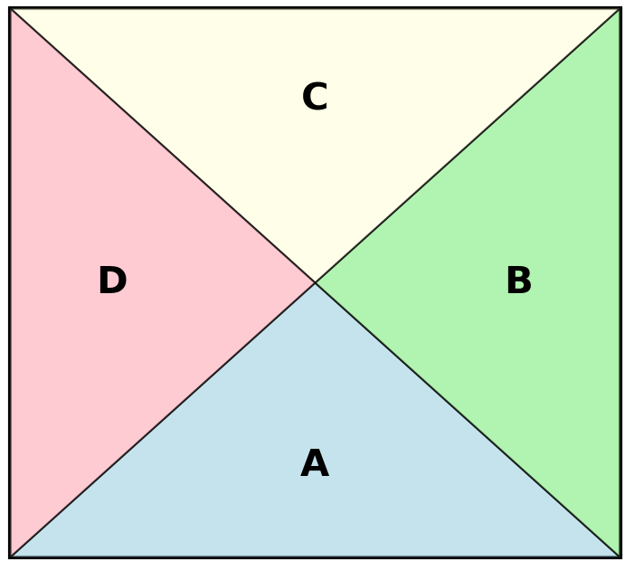

#### 顺逆时针 $90^0$ 旋转一个矩阵 
**对于$ N \times N $的矩阵而言:**  

坐标$[i,j]$顺时针旋转$90^0$ 后会来到位置<mark>$[j,n-i-1]$</mark>
坐标$[i,j]$逆时针旋转$90^0$ 后会来到位置<mark>$[n-j-1,i]$</mark>

**可以利用坐标的位置变化实现整个矩阵的旋转，以顺时针旋转90度来举例**  
- 点$[i,j]$移动到$[j,n-i-1]$
- 点$[j,n-i-1]$移动到$[n-i-1,n-j-1]$
- 点$[n-i-1,n-j-1]$移动到$[n-j-1,i]$
- 点$[n-j-1,i]$移动到$[i,j]$  

将点$[i,j]$分三次交换即可完成整个矩阵的旋转  

**实现原地交换，不占用额外的空间**
$ A = A+B $ 
$ B = A-B $  
$ A = A-B $

